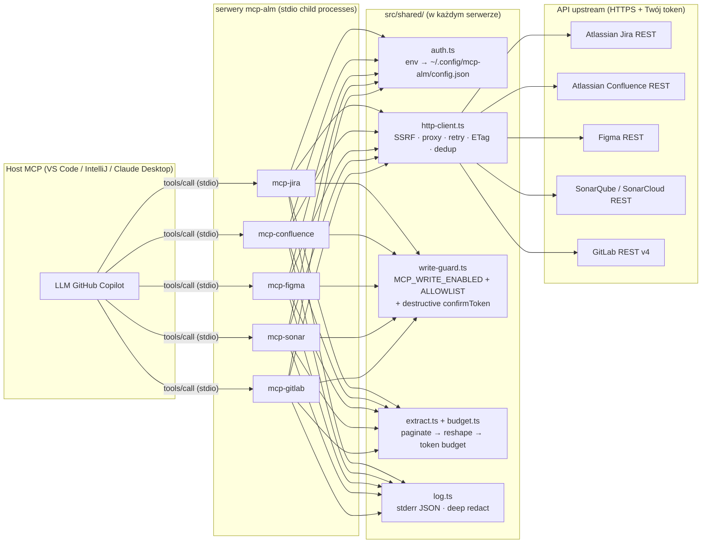

# mcp-alm — referencja architektury

> Jeden akapit + diagram mermaid + słowniczek. Jeśli potrzebujesz więcej
> głębi, patrz [`docs/explanation/architecture.md`](../docs/explanation/architecture.md)
> i [`docs/explanation/security-architecture.md`](../docs/explanation/security-architecture.md).

## Jeden akapit

Każdy `src/server-<tool>.ts` to samodzielny binarny ESM Node 22, mówiący
JSON-RPC po **stdio** — transport MCP. Host (VS Code 1.121+, IntelliJ AI
Assistant 2026.1.2+, Claude Desktop, …) uruchamia jeden z pięciu serwerów
jako proces dziecięcy i forwarduje każde `tools/list` / `tools/call`
widziane od LLM. Narzędzia są deklarowane przez **schematy Zod**,
auto-konwertowane do JSON Schema dla `tools/list`, sparsowane przed
uruchomieniem jakiegokolwiek handlera. Wspólna warstwa (`src/shared/`)
posiada uwierzytelnianie, wrapper HTTP (SSRF guard, proxy, retries, ETag,
in-flight dedup, body cap), dwupoziomowy write-guard i pipeline ekstrakcji
budget-aware, który trzyma odpowiedzi narzędzi wewnątrz per-call budżetów
tokenów. Logi idą do **stderr** tylko (stdout to ramka MCP) w formacie
JSON-line z deep token redaction.

## Mermaid

## Słowniczek

- **MCP** — Model Context Protocol. JSON-RPC 2.0 po stdio (lub HTTP/SSE);
  hosty odkrywają i wywołują narzędzia, które serwery rejestrują.
- **Tool** — funkcja z JSON Schema, deklarowana tu przez Zod i wystawiana
  w `tools/list`.
- **Konektor** — cienki kod, który zamienia jedno upstream API w typed
  metody wywoływalne przez narzędzia serwera.
- **Write guard** — dwupoziomowa bramka env-var (`MCP_WRITE_ENABLED` +
  allowlist, plus destructive confirm token) zapobiegająca mutacjom,
  dopóki operator nie zrobi explicit opt-in.
- **Pipeline ekstrakcji** — `paginate → reshape → budget`. Zatrzymuje się
  na ceilingu per-call `BudgetTracker`; wystawia `truncated` + kursor `next`.
- **SSRF guard** — odmawia wywołań upstream do loopback, RFC1918,
  link-local, IPv6 ULA; opt-out per-proces przez
  `MCP_ALM_ALLOW_PRIVATE_HOSTS=true`.

## Czego świadomie NIE robimy

- Brak memory MCP server w domyślnym `.mcp.json` (pisałby kontekst LLM do
  dysku, problem pod DLP).
- Brak internet-fetching server w domyślnym `.mcp.json` (nie zadziała w
  air-gapped intranetach).
- Brak transportu HTTP / SSE — tylko stdio. (HTTP transport jest na MCP
  roadmap, ale nie wymagany dla IDE-local workflow, na który ten repo
  celuje.)
- Brak telemetrii / phone-home. Dane użycia są in-memory only
  (`*.get_usage_history`) i dropowane przy exit procesu.
