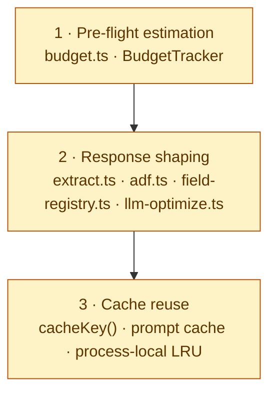

# Optymalizacja zapytań do LLM

Trzy warstwy obrony: **pre-flight estimation** → **response shaping** → **cache reuse**. Stosuje się do każdego MCP toola, każdego pipeline'u ekstrakcji i każdej odpowiedzi wracającej do agenta.

Zmarnowany token = wolniejsza odpowiedź, wyższy rachunek, wcześniejszy overflow kontekstu, słabszy reasoning (szum pogarsza dobór).



## Reguły

### 1. Estymuj zanim wyślesz

Każda operacja >50k tokenów ma `BudgetTracker`. Zwróć `truncated: true` + `next` cursor zamiast cichego ucięcia.

```ts
const budget = new BudgetTracker(60_000); // ~30% kontekstu Claude 200k
```

### 2. Kompaktowy JSON

Wyrzuć `null`, `undefined`, puste tablice/obiekty. `JSON.stringify(compactJson(value))`, nigdy `JSON.stringify(value, null, 2)` (pretty-print = ~30% tokens waste).

### 3. Streszczaj długie tablice

Tablica > 50 → `summarizeArray()`: `{ head, tail, total, truncated: true }`.

### 4. ADF / HTML → Markdown

Nigdy raw ADF JSON / HTML do LLM. `adfToMarkdown()` — **~3× redukcja** + lepszy reasoning.

### 5. Custom-field reshape

Nigdy `customfield_NNNNN` do modelu. `reshapeFieldValue()` — **~1.5× redukcja** + agent rozumie "Story Points" zamiast "customfield_10042".

### 6. Cache identycznych promptów

Statyczne odpowiedzi (rejestr pól, schemat tooli, lista projektów) → proces-local LRU z TTL ≥ 60s, klucz `cacheKey([toolName, ...params])`. Anthropic prompt cache: `cache_control: { type: 'ephemeral' }` dla long-running tool descriptions (5-min hit window).

### 7. English w `description` MCP toola

`description` wysyłane przy **każdym** `list_tools`. Polski tokenizuje się ~1.4× drożej. Krótki, czasownikowy, EN.

✅ `"Search Jira issues by JQL. Returns up to 50 issues per page."`
❌ `"Wyszukuje zgłoszenia w Jirze według zapytania JQL. Zwraca maksymalnie 50 elementów na stronę."`

### 8. Tylko potrzebne pola

`fields: string[]` parametr — zwracaj tylko to o co LLM pyta.

### 9. Truncate, nie crashuj

`truncate(text, maxTokens, '\n…[truncated]')` — zawsze string w budżecie. Degraduj, nie odrzucaj.

### 10. Deterministyczne skrypty dla powtarzalnych operacji

Powtarzalne well-defined operacje (review, scaffold, audyt linków, regen API docs) wykonuj **skryptem TypeScript / Node** o stałej kolejności kroków — nie ad-hoc promptem.

**Wygrane:** powtarzalność (CI gates), oszczędność tokenów (skrypt nie zużywa kontekstu na re-derivację procedury), audytowalność (logika w repo, prompt znika), composability (hook / CI / slash).

**MUSI być skryptem (nie promptem):**

- Bootstrap → `npm run bootstrap` (`tools/scripts/bootstrap.mjs`)
- Per-connector healthcheck → `npm run doctor`
- AI config validation → `npm run ai:validate`
- Full gate przed push → `npm run verify`

**MOŻE pozostać promptem:** code review wymagający osądu domeny, spec-driven workflow z unique kontekstem per krok, eksploracja kodu.

**Reguła ekstrakcji:** drugi raz w tygodniu ten sam prompt-template → wyciągnij deterministyczne kroki do skryptu. Skrypt może wywołać LLM dla pod-problemu, ale orchestrate'uje deterministycznie.

### 11. Żaden raw read passthrough bez capa / reshape / adnotacji

Każdy `return http.request(...)` z **read** toola MUSI być albo capowany (text), albo reshapowany (json), albo świadomie oznaczony — nigdy surowy nieograniczony payload prosto z API. To martwy punkt audytu `token:budget` (skanuje tylko Zod `.max/.default` — tool bez capa nie ma czego zeskanować).

- **Text** (pliki, logi, diffy) → `headBytes()` (head-first) / `tailBytes()` (tail-first) / `truncate()` (proza). Zwróć `{ content, totalBytes, returnedBytes, truncated }`.
- **Tree** (Figma document) → `pruneNodeTree(children, maxNodes)` → przycięte drzewo + `_truncated` + `_nodeCount`.
- **JSON read** — rosnąca lista (`*.list_*`) → reshape do canonical + `limit` (jak `list_issues` / `list_versions`); bounded single-entity (`quality_gate`, `list_transitions`) → `// passthrough-ok: <reason>`.

Gate `npm run validate:passthrough` (wpięte w `verify`) blokuje **każdy un-annotated read passthrough** — text bez cap-helpera ORAZ json-read bez reshape. Write-toole (POST/PUT/DELETE) zwracające echo encji są wyłączone. Klasa tree pilnowana testami `pruneNodeTree` (brak taniego statycznego sygnału na „unbounded JSON tree"). Pełna inwentaryzacja: `npm run validate:passthrough -- --report`.

✅ `const raw = await http.request(...); return { items: raw.values.map(reshape), count };`
✅ `// passthrough-ok: bounded single entity` nad `return http.request(...)`
❌ `return http.request({ path: '/api/projects/search' });` // raw lista bez reshape

## Domyślne budżety per klasa zadania

| Klasa                          | Budżet (tokens) | Uzasadnienie                              |
| ------------------------------ | --------------- | ----------------------------------------- |
| Single fetch (1 issue, 1 page) | 5 000           | Pojedyncze wywołanie, brak paginacji      |
| List / search (1-2 stron)      | 20 000          | Typowe zapytanie z filtrami               |
| Search z paginacją             | 60 000          | ~30% kontekstu Claude 200k                |
| Bulk export (z trunkacją)      | 100 000         | Max dla single-call                       |
| Compliance / pełen audyt       | 150 000         | Special; orchestrator dzieli na sub-tasks |

Override per tool przez `budget?: number` w args.

## Anti-patterns

- ❌ `JSON.stringify(value, null, 2)` przy zwracaniu do LLM
- ❌ Raw payload z Atlassiana
- ❌ Pełne pliki gdy wystarczy slice ±25 linii
- ❌ Polski w MCP tool `description`
- ❌ Hard-cap "fetch 1000 latest" bez `truncated` flagi
- ❌ Gołe `console.log(huge_object)` (logi + potencjalnie LLM)
- ❌ Pełny ADF w prompt (JSON ~3× tokens vs Markdown)
- ❌ `return http.request<string>(...)` bez `headBytes`/`tailBytes` (surowy plik/log prosto do kontekstu)
- ❌ Zwrot całego Figma document bez `pruneNodeTree` (5+ MB drzewo)
- ❌ `return http.request(...)` z rosnącą listą bez reshape/`limit` (np. raw `project/search`)

## Implementacja referencyjna

`src/shared/`: `budget.ts` (BudgetTracker, estimateTokens, truncate) · `extract.ts` (paginate → reshape → charge → stop) · `pagination.ts` (offset / cursor adapters) · `adf.ts` (ADF → Markdown) · `field-registry.ts` (custom-field reshape) · `llm-optimize.ts` (compactJson + summarizeArray + LRU) · `byte-cap.ts` (headBytes — head-cap plików) · `figma-node-tree.ts` (countNodes + pruneNodeTree — cap drzewa Figmy).

## Zobacz też

- [`architecture.md`](../architecture.md) — kompozycja modułów + mermaid
- [`production-readiness.instructions.md`](production-readiness.instructions.md) §3 (Monitoring), §4 (Cost control)
- [`language.instructions.md`](language.instructions.md) — dlaczego MCP `description` po angielsku
- [`connectors.instructions.md`](connectors.instructions.md) — kontrakt connectora używającego ekstrakcji
