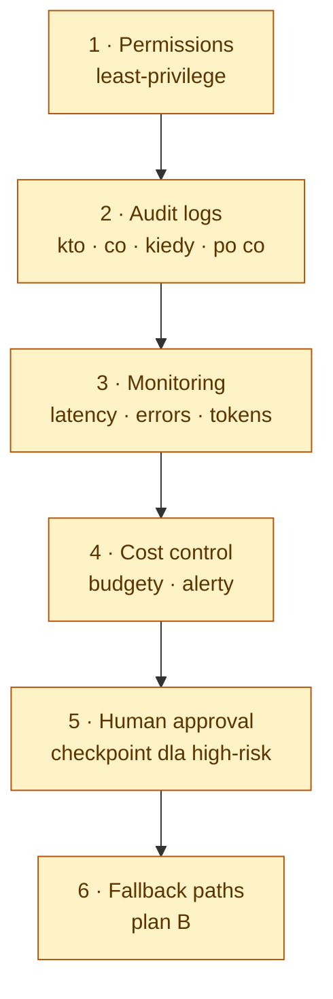

# Production readiness — sześć must-haves

Każda zmiana funkcjonalna MUSI spełnić te sześć kontroli **przed** wystawieniem jako tool dostępny dla agenta wykonującego mutacje. Rozszerza [`security.instructions.md`](security.instructions.md) o operations kontrole.

## 1. Permissions — least-privilege

Agent dostaje tylko scopes / tokens / paths potrzebne do aktualnego zadania. Blast radius = unia uprawnień.

- Tokeny per-feature, nie per-user-everything (write-token Jira ma `write:issue`, nie `admin`).
- FS dostęp minimalny — `mcp-alm` nie czyta plików projektu w ogóle. Czyta wyłącznie tokeny z `~/.config/mcp-alm/config.json` przy starcie ([`user-config.ts`](../../src/shared/user-config.ts)).
- Calls sieciowe przez `*_BASE_URL` + SSRF guard blokujący loopback / RFC1918 / link-local ([`http-client.ts`](../../src/shared/http-client.ts)).
- Tokeny czytane **at use-time** z env / user-profile config, nigdy z repo.
- `assertWriteAllowed()` to canonical guard. Każde nowe mutujące narzędzie wrappuje przed side-effectem.

## 2. Audit logs — kto · co · kiedy · po co

Każda state-mutating akcja: actor, narzędzie, input fingerprint, outcome, timestamp, correlation id. Post-incident forensics + SOC 2 / ISO 27001 / AI Act compliance.

- `log()` structured JSON do **stderr** (nigdy stdout — to ramka MCP).
- Każdy `handle()` wrappuje pracę w `timed(server, tool, fn)` ([`log.ts`](../../src/shared/log.ts)).
- Inputy z sekretami **fingerprinted** (sha256 prefix), nigdy raw.
- Centralny log shipper zbiera stderr stream; retention ≥ 90 dni.

**Anti-patterns:** `console.log(token)`, silent swallowing exceptions, logowanie pełnych request bodies.

## 3. Monitoring — latency · errors · tokens

Real-time dashboardy na czterech liczbach: **latency** p50/p95/p99, **error rate** per tool/upstream, **token usage** in+out, **tool fan-out** per turn.

- Metryki emitowane obok log entries (lub ekstrahowane).
- On-call runbook dla każdego red threshold.
- Panele wersjonowane w repo.

Silent regression podwajający latency lub token cost inaczej niewykryty przez tygodnie.

## 4. Cost control — budgety · alerty

Twardy sufit na monthly spend per project + alerty na 50 / 80 / 100% budżetu. LLM spend skaluje się superlinearnie ze złymi promptami i runaway loops.

- Budgety na poziomie API-key (Anthropic, OpenAI, Sentry, …).
- **Killswitch** — gdy budget wyczerpany, narzędzie zwraca `BudgetExceededError`, nie cicho ucina.
- Cost atrybuowany per repo / per feature (właściciel spike jednoznaczny).

## 5. Human approval — checkpoint dla high-risk akcji

Mutujące akcje matching "high-risk" predicate wymagają confirmation którą **człowiek** (nie agent) clearuje. _MCP umożliwia akcję; nie decyduje._

**High-risk predicates (non-exhaustive):** usuwanie / przenoszenie production data, sending external email / Slack / Teams w imieniu usera, postowanie public content, wydawanie pieniędzy, przyznawanie / odbieranie dostępu, akcje przekraczające regulacyjną granicę (AI Act, GDPR, financial).

- Input schema mutującego narzędzia wymaga `confirm: true`, default `false`.
- Human-readable podsumowanie "co się ma zmienić" przed akcją.
- Audit log łapie tożsamość zatwierdzającego.

## 6. Fallback paths — plan B

Każdy agent flow ma udokumentowany degraded mode. "Sentry down" / "model zwraca 5xx" / "Jira rate-limited" — orchestrator spadą z gracją, nie crashuje.

- Każde narzędzie MCP dokumentuje **fail-mode contract** (co zwraca gdy upstream down).
- Retries bounded (≤ 3 próby + exponential backoff), logowane.
- Circuit-breaker tripuje na repeated failure (open ≥ 30 s przed half-open retry).
- End user dostaje czysty komunikat ("X niedostępne, spróbuj za Y minut"), nigdy stack trace.

## End-of-feature checklist

Architect zatwierdza przed "production-impacting":

- [ ] **Permissions** — scopes minimalne; FS + network sandboxed.
- [ ] **Audit logs** — każde mutujące wywołanie przez `timed()`; sekrety fingerprinted.
- [ ] **Monitoring** — metryki latency / error / token widoczne na dashboardzie.
- [ ] **Cost control** — feature pod budgetem z at-thresholds alerts.
- [ ] **Human approval** — high-risk predicates wymagają `confirm: true` + summary.
- [ ] **Fallback** — każdy upstream ma fail-mode contract + circuit-breaker.

Checklista pojawia się w orchestrator's "Definition of Done" gate obok lint / test / build.
