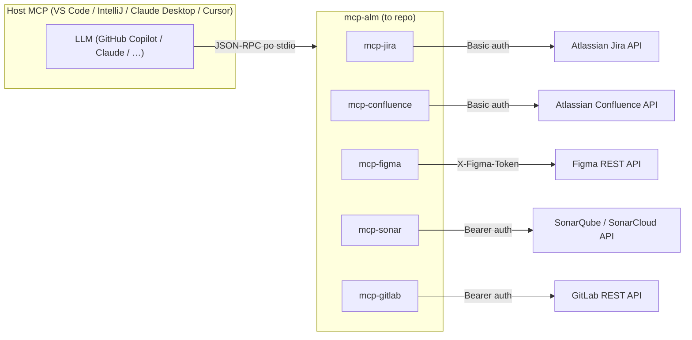
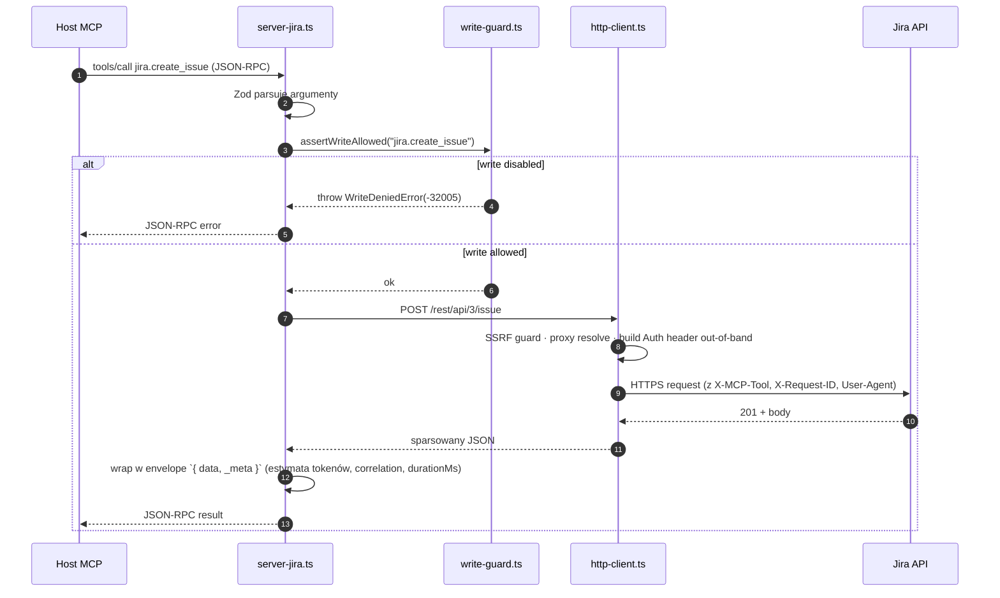

# Architektura

> Czym jest to repo, co jest wewnątrz i jak elementy się składają.

## Kształt w skrócie

mcp-alm wystawia dwie bramki nad tą samą warstwą `src/shared/`:

1. **MCP stdio** — **pięć samodzielnych serwerów**, każdy mówiący JSON-RPC po
   stdio. Host (VS Code 1.121+, IntelliJ AI Assistant / GitHub Copilot
   2026.1.2+, Claude Desktop, Cursor, własny kod Agent SDK) uruchamia jeden z
   nich jako proces dziecięcy. Każdy serwer rejestruje **trzy MCP
   capabilities**: **tools** (`tools/list` + `tools/call` — operacje upstream),
   **prompts** (`prompts/list` + `prompts/get` — preconfigured slash-commands)
   i **resources** (`resources/list` + `resources/read` — read-only docs
   cache'owane przez hosta). **Interactive, niedeterministyczne** (agent
   decyduje co wywołać).
2. **Skrypty ekstrakcji** — `src/extract-{jira,confluence}.ts`,
   config-driven (`extract.config.<connector>.json`). **Non-interactive,
   deterministyczne** dla identycznego configu + identycznego stanu
   upstreamu. Use case: snapshoty, compliance audit, eval-sety. Szczegóły:
   [`docs/how-to/data-extraction.md`](../how-to/data-extraction.md).

Obie bramki dzielą 100% kodu reshape / auth / http-client / SSRF. Single
source of truth dla projekcji pól.



Model decyduje _co_ zrobić; to repo dostarcza _jak_ bezpiecznie mówić z
systemami ALM.

## Layout repo

```
mcp-alm/
├── src/
│   ├── server-jira.ts          # bramka 1: serwer MCP stdio per system ALM
│   ├── server-confluence.ts
│   ├── server-figma.ts
│   ├── server-sonar.ts
│   ├── server-gitlab.ts
│   ├── extract-jira.ts         # bramka 2: deterministyczny snapshot Jira (config-driven)
│   ├── extract-confluence.ts   # bramka 2: deterministyczny snapshot Confluence
│   └── shared/
│       ├── http-client.ts      # wrapper natywnego fetch: SSRF, proxy, retry, ETag, dedup, body cap
│       ├── auth.ts             # token resolution (env → user-config → throw)
│       ├── user-config.ts      # ładuje ~/.config/mcp-alm/config.json
│       ├── write-guard.ts      # dwupoziomowy mutation gate (env + allowlist + constant-time confirm)
│       ├── log.ts              # structured stderr logger z głęboką redakcją
│       ├── errors.ts           # MCP / JSON-RPC error codes
│       ├── mcp-server.ts       # tool registration, dispatch, response envelope
│       ├── extract.ts          # pipeline paginate → reshape → budget
│       ├── budget.ts           # BudgetTracker, estimateTokens
│       ├── pagination.ts       # adaptery offset / cursor per styl upstream
│       ├── adf.ts              # Atlassian Document Format → Markdown
│       ├── field-registry.ts   # reshape custom fields Jira
│       └── …                   # mniejsze helpery (cql, jql, response-meta, session-tracker)
├── tools/
│   └── scripts/
│       ├── bootstrap.mjs       # one-command repo init (cross-platform)
│       ├── doctor.mjs          # config + per-konektor health check
│       └── validate-ai-config.mjs   # walidacja .mcp.json + .github/ frontmatter
├── docs/                       # dokumentacja Diátaxis (ten katalog)
└── .github/                    # reguły (`instructions/`), prompts, workflows CI
```

Każdy `server-*.ts` to mała composition root: zadeklaruj narzędzia
(Zod-walidowane), zarejestruj handlery, podłącz stdio. Prawdziwa praca —
auth, HTTP, mapowanie błędów, shaping budżetu tokenów — żyje w
`src/shared/`.

## Typowe wywołanie, sekwencja



## Kluczowe decyzje projektowe

Spisane w `docs/adr/`. Patrz [indeks ADR](../adr/README.md) po kanoniczną
listę.

- **Jeden serwer stdio per system ALM** — least privilege; tokeny scoped
  per binarka; łatwo wyłączyć konektor usuwając go z konfiguracji
  hosta. ([0001](../adr/0001-mcp-stdio-transport.md))
- **Zod wszędzie** — każdy input narzędzia to schema Zod; runtime
  validation zapobiega garbage-in / garbage-out i produkuje JSON Schema dla
  `tools/list` automatycznie. ([0002](../adr/0002-zod-input-validation.md))
- **Write-guard runtime check** — każde mutujące narzędzie woła
  `assertWriteAllowed()`; guard czyta `MCP_WRITE_ENABLED` +
  `MCP_WRITE_ALLOWLIST`; default to deny.
  ([0003](../adr/0003-write-guard-runtime.md))
- **Tokeny przez env lub user-profile config, nigdy argv ani stdin** — env
  vars są scoped do procesu dziecięcego; stdout jest zarezerwowany dla
  protokołu MCP. ([0004](../adr/0004-token-env-only.md))
- **Tylko natywny fetch** — Node 22 dostarcza `fetch`; jedna mniej
  zależność, jedno mniej supply-chain risk.
  ([0005](../adr/0005-native-fetch-no-axios.md))

## Czego w tym repo świadomie NIE ma

- **Brak logiki orkiestracji.** mcp-alm to tool provider — LLM hosta
  decyduje co wywołać.
- **Brak memory MCP w domyślnym `.mcp.json`.** Memory MCP persystowałby
  kontekst agenta (treść ticketów, zawartość stron) na dysku, co jest
  problematyczne pod większością enterprise DLP. Opt-in udokumentowany w
  [`docs/getting-started/enterprise-intranet.md`](../getting-started/enterprise-intranet.md).
- **Brak internet-fetching MCP w domyślnym `.mcp.json`.** Nie zadziała w
  intranetach air-gapped; dodaje egress point. Ten sam opt-in path, jeśli
  Twoja polityka pozwala.
- **Brak transportu HTTP / SSE.** Tylko stdio. (Streamable HTTP transport
  jest na MCP roadmap, ale nie jest wymagany dla IDE-local workflow, na
  który ten repo celuje.)
- **Brak telemetrii, brak phone-home.** Dane użycia żyją tylko in-memory
  (`*.get_usage_history`) i są dropowane przy exit procesu.

## Dalsza lektura

- [Architektura bezpieczeństwa](security-architecture.md) — model
  zagrożeń, defence in depth, redakcja.
- [Wzorzec write-guard](write-guard.md) — jak mutacje są bramkowane.
- [Kontrakt konektora](../../.github/instructions/connectors.instructions.md) —
  reguły, które każdy konektor implementuje.
- [Referencja konfiguracji](../reference/configuration.md) — każda env var,
  której serwery przestrzegają.
