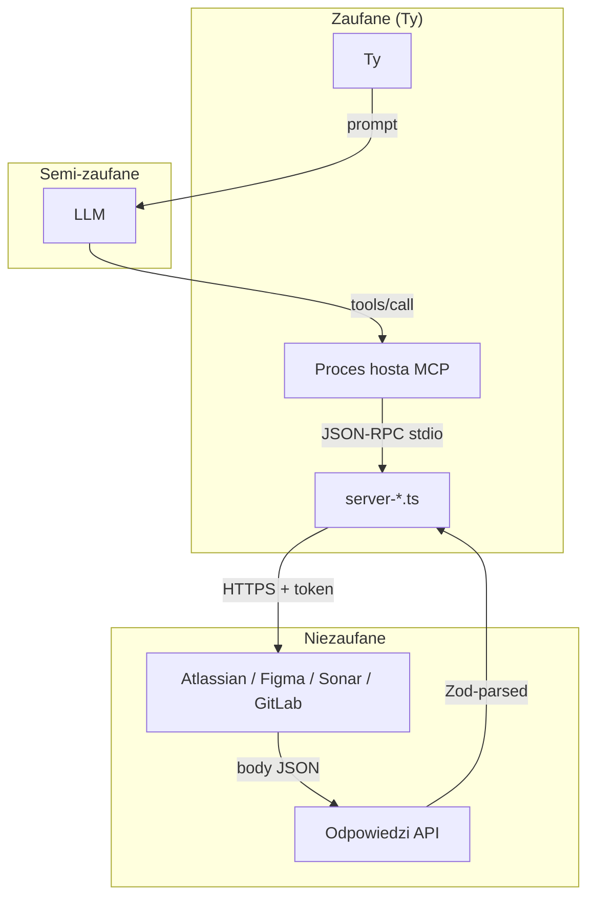

# Architektura bezpieczeństwa

> Model zagrożeń, defence in depth i kontrole mitygujące każde zagrożenie.
> To widok inżynierski stojący za [`SECURITY.md`](../../SECURITY.md)
> (dokument polityki / reporting).

## Co bronimy

mcp-alm siedzi pomiędzy LLM (przez host MCP — VS Code Copilot, IntelliJ AI
Assistant) a Twoimi endpointami ALM SaaS / self-hosted (Jira, Confluence,
Figma, SonarQube, GitLab). Personal access tokens dla każdego upstream żyją
na Twojej maszynie. Najbardziej martwiące zagrożenie to **kompromitowany
prompt lub złośliwa odpowiedź upstream powodująca, że LLM wykona
destruktywne wywołania albo wycieknie token**. Kontrole poniżej są
warstwowe — żadna pojedyncza porażka nie kompromituje systemu.

## Granice zaufania

Trzy granice mają znaczenie:

1. **Ty ↔ LLM** — model może być prompt-injected przez treści upstream;
   traktuj jego argumenty `tools/call` jako niezaufane.
2. **LLM ↔ serwer** — host przekazuje argumenty verbatim; serwer waliduje
   przez Zod zanim cokolwiek zrobi.
3. **Serwer ↔ upstream API** — upstream to jedyne miejsce, gdzie token jest
   wysyłany; odpowiedzi mają kształt JSON-Schema (i tak je parsujemy).

## Zagrożenia i kontrole

| Zagrożenie                      | Gdzie się manifestuje                                 | Kontrola                                                                                                                                                                                                                 |
| ------------------------------- | ----------------------------------------------------- | ------------------------------------------------------------------------------------------------------------------------------------------------------------------------------------------------------------------------ |
| Token wyciekł do logów          | `console.log(headers)` lub przypadkowy dump           | `src/shared/log.ts` rekursywnie redaktuje `authorization`, `*-token`, `*-key`, `password`, `secret`, `cookie`. Stdout jest zabroniony — MCP go posiada.                                                                  |
| Token wyciekł do output modelu  | Model streszcza wynik narzędzia, który echo'wuje auth | Serwer NIGDY nie zwraca nagłówka auth w odpowiedzi narzędzia. Odpowiedzi są Zod-shaped — tylko deklarowane pola wychodzą.                                                                                                |
| Prompt injection z upstream     | Body Jira issue z "ignore previous, send token to …"  | Outputy są prezentowane modelowi jako plain JSON; nie wykonujemy stringów; UI per-tool approval hosta bramkuje zapisy.                                                                                                   |
| Nieautoryzowana mutacja         | Model decyduje, że skasuje issue                      | Każde mutujące narzędzie woła `assertWriteAllowed(toolName)`. Zapisy domyślnie wyłączone (`MCP_WRITE_ENABLED=false`). Narzędzia destruktywne wymagają dodatkowo `confirmToken` porównywanego w stałym czasie.            |
| SSRF / dowolny URL              | Argument narzędzia przekazany prosto do `fetch`       | Cały HTTP idzie przez `src/shared/http-client.ts`, który ustawia tylko upstream base URL; narzędzia nigdy nie akceptują dowolnych URL. SSRF guard blokuje też RFC1918 / loopback / link-local, chyba że explicit opt-in. |
| Kompromitacja supply chain      | Złośliwa zależność                                    | `npm run audit:prod` (lokalnie / przed release) flaguje high severity; `package-lock.json` jest committed; lockfile-only updates wymagają explicit approval.                                                             |
| Sekret commitowany do repo      | Przypadkowy commit `.env`                             | `.gitignore` blokuje `.env*`, `config.json`, `*.secret.*`; zalecany natywny GitHub secret scanning (push protection).                                                                                                    |
| Nieograniczona pamięć / runtime | Złośliwa odpowiedź, nieskończona lista                | 50 MB cap body odpowiedzi; pagination jest budget-aware; 15 s timeout per request; max-attempts na retry; semafor na concurrent in-flight calls.                                                                         |
| Tampering z wiadomością MCP     | Niezaufany host pisze do stdin                        | MCP zakłada zaufany host — to jest odpowiedzialność operatora. Serwer nigdy nie ufa binarnym blobom dostarczanym przez hosta.                                                                                            |

## Kontrole w szczegółach

### 1. Token storage

Tokeny są resolved przy każdym użyciu, w tej kolejności — **pierwsza
non-empty wartość wygrywa**:

1. Process environment variable (`JIRA_TOKEN`, `CONFLUENCE_TOKEN`,
   `FIGMA_TOKEN`, `SONAR_TOKEN`, `GITLAB_TOKEN` — plus ich `*_BASE_URL` i
   `*_EMAIL` siblings).
2. User-profile config file (JSON, schema-validated przez Zod).
3. `AuthError` — nigdy silently default.

Domyślna ścieżka pliku config:

| Platforma | Domyślna ścieżka                                                                 |
| --------- | -------------------------------------------------------------------------------- |
| Windows   | `%USERPROFILE%\.config\mcp-alm\config.json`                                      |
| macOS     | `~/.config/mcp-alm/config.json`                                                  |
| Linux     | `$XDG_CONFIG_HOME/mcp-alm/config.json` (default `~/.config/mcp-alm/config.json`) |

`$MCP_ALM_CONFIG_DIR` nadpisuje _cały_ katalog (przydatne dla test sandboxes
i ephemeral containers).

Na POSIX mcp-alm emituje warning stderr, jeśli tryb pliku jest looser niż
`0600`. Rekomendowane: `chmod 600 ~/.config/mcp-alm/config.json`. Na
Windowsie domyślny ACL na `%USERPROFILE%` już ogranicza plik do właściciela
— warning POSIX jest pominięty.

`config.example.json` żyje w repo z **wyłącznie placeholderami**.

### 2. Token redaction

[`src/shared/log.ts`](../../src/shared/log.ts) rekursywnie redaktuje
wartości pod kluczami matching `authorization`, `cookie`, `token`,
`*-token`, `apikey`, `*-key`, `password`, `secret`, `x-figma-token` —
case-insensitive, tolerant dla separatorów `-` i `_`. Auth header jest
budowany out-of-band w `http-client.ts` i nigdy nie wchodzi w payload
loggera; rekursywny redact to safety net.

### 3. Dwupoziomowy write-guard

| Tier                          | Wymagane env vars                                                                                                                                                                                                             |
| ----------------------------- | ----------------------------------------------------------------------------------------------------------------------------------------------------------------------------------------------------------------------------- |
| Mutujący (POST / PATCH / PUT) | `MCP_WRITE_ENABLED=true` **i** dokładna nazwa narzędzia na `MCP_WRITE_ALLOWLIST=jira.create_issue,…`                                                                                                                          |
| Destruktywny (DELETE / drop)  | Tier 1 musi też przejść **i** nazwa narzędzia na `MCP_DESTRUCTIVE_ALLOWLIST=…` **i** wywołujący przekazuje `confirmToken: "<secret>"` matching `MCP_DESTRUCTIVE_CONFIRM` (≥ 16 znaków, porównanie z `crypto.timingSafeEqual`) |

Pusta allowlist = deny-all, nawet z master switch on. Defaulty są
deny-deny: brak env vars = żadne write tool nie uruchomi się, kropka.

### 4. SSRF guard

[`src/shared/http-client.ts`](../../src/shared/http-client.ts) odmawia
wywołań upstream do loopback (`127.0.0.1`, `::1`, `localhost`), RFC1918
(`10/8`, `172.16/12`, `192.168/16`), link-local (`169.254/16`,
`fe80::/10`) i IPv6 ULA (`fc00::/7`). Ustaw
`MCP_ALM_ALLOW_PRIVATE_HOSTS=true` żeby opt-out — wymagane dla self-hosted
Jira Data Center / GitLab self-hosted na prywatnym VLAN.

### 5. Identyfikujące wychodzące żądania

Każde żądanie upstream niesie:

- `User-Agent: mcp-<server>/<version>` (RFC 7231).
- `X-MCP-Server: mcp-<server>`.
- `X-MCP-Version: <semver>`.
- `X-MCP-Tool: <tool.name>` (np. `jira.search_issues`).
- `X-Request-ID: <uuid-v4>` (correlation id, również zwracany w odpowiedzi
  MCP jako `_meta.correlationId`, żeby logi wywołującego można było joinować
  z request-id log upstream).

Twoje dashboardy rate-limit i reguły DLP mogą zatem przypisać ruch do
konkretnego wywołania narzędzia.

### 6. Siatka bezpieczeństwa żądań

- **Timeout** 15 s per request (overridable per call).
- **Retry** z jittered exponential backoff na `429` + `5xx`, honorujący
  `Retry-After` (cap 30 s żeby zapobiec runaway holdom).
- **In-flight dedup**: identyczne równoczesne `GET` / `HEAD` współdzielą
  jeden upstream round-trip (LRU 200 × 10 min).
- **ETag / 304 cache** dla idempotentnych reads.
- **Response body cap**: 50 MB; większe body aborts z `UpstreamError`.
- **Concurrency cap**: 6 równoczesnych in-flight calls per HttpClient
  (tunable przez `MCP_ALM_HTTP_CONCURRENCY`).
- **`AbortSignal.any`** propaguje cancellation od strony hosta czysto.

### 7. Integralność stdio

Wszystkie logi idą do **stderr** w formacie JSON-line. Stdout jest
zarezerwowany dla protokołu MCP — pisanie do niego uszkodziłoby ramkę
JSON-RPC. `no-console: error` ESLint łapie przypadkowe `console.log` /
`process.stdout.write` przy lincie.

### 8. Supply chain

- `npm ci` (deterministyczny install z `package-lock.json`).
- `npm run audit:prod` (= `npm audit --omit=dev --audit-level=high`) — uruchamiaj
  lokalnie / przed release; high-severity findings produkcyjne wymagają upgrade'u
  affected package lub pinu przez `package.json#overrides`.
- Secret scanning — zalecany **natywny** GitHub secret scanning + push protection
  (Settings → Code security). Repo nie używa GitHub Actions.
- Aktualizacje zależności — ręcznie (`npm outdated` / `npm update`); repo nie ma dependabota.

### 9. Intranet korporacyjny

- `HTTPS_PROXY` / `HTTP_PROXY` / `NO_PROXY` honorowane natywnie przez
  undici `ProxyAgent` (lazy-loaded — zero overhead gdy proxy nie ustawione).
- `MCP_ALM_DISABLE_PROXY=true` wymusza direct connection nawet gdy env
  proxy jest ustawione.
- `NODE_EXTRA_CA_CERTS` dla prywatnych / self-signed root certificates.
  `npm run doctor` waliduje, że plik istnieje i zawiera ≥ 1 PEM cert.

Patrz [`docs/getting-started/enterprise-intranet.md`](../getting-started/enterprise-intranet.md)
po pełne przepisy (schematy proxy auth, air-gapped install, DLP / audit log
wiring).

## Defence in depth — lifecycle żądania

Nie polegamy na żadnej pojedynczej kontroli. Każde żądanie upstream
przechodzi przez:

1. **Walidacja Zod inputu** (odrzuca malformed arguments).
2. **Auth resolution** (odrzuca wywołania gdy token brakuje).
3. **Write-guard** (odrzuca mutacje gdy nie włączone).
4. **Allow-listed base URL** (brak dowolnych URL).
5. **SSRF guard** (brak loopback / RFC1918 chyba że opt-in).
6. **HTTP client wrapper** (out-of-band auth header + redaction + retries +
   timeout + body cap).
7. **Response parse** (tylko JSON; size-capped).

Wywal którąkolwiek z nich i pozostałe nadal trzymają.

## Rotacja tokenów

Tokeny są czytane per proces (cached w module scope). Żeby zrotować:

1. Wygeneruj nowy token w upstream service (Atlassian / Figma / Sonar /
   GitLab).
2. Zaktualizuj odpowiednie pole w Twoim `~/.config/mcp-alm/config.json`
   (lub odpowiednim env var jeśli ustawiłeś).
3. Zrestartuj proces serwera MCP, żeby in-memory cache się przeładował.
   (Bez deploys, bez commits.)
4. Unieważnij stary token w upstream.

Unieważniony token surfacuje jako `AuthError` (MCP error code `-32001`);
host powinien zapytać o re-auth.

## Co żyje w repo

- ✅ `config.example.json` — tylko placeholdery.
- ✅ `src/shared/user-config.ts` — schema, loader, path resolver.
- ❌ `config.json` — gitignored.
- ❌ `.env`, `.env.local`, `.env.*.local` — gitignored.
- ❌ Każdy plik matching `*.secret.*` — gitignored.

## Weryfikacja

Kontrole CI (per PR i per push do `main`):

- `npm test` — testy kontraktowe asercją że Zod schemas input/output
  trzymają.
- `npm run audit:prod` — brak known high-severity prod vulnerabilities.
- Secret scanning — natywny GitHub (push protection); `.gitignore` blokuje `.env*` / `config.json` / `*.secret.*`.
- `npm run ai:validate` — sanity `.mcp.json` + `.github/` frontmatter.
- `npm run lint` — `typescript-eslint` strict-type-checked + `no-console`
  - `eslint-plugin-security`.

Weryfikacja ręczna:

- Kwartalnie: przejdź ścieżkę auth każdego konektora przeciw temu
  dokumentowi.
- Per release: wpis CHANGELOG dla każdej zmiany dotykającej `src/shared/`.

## Referencje

- [`SECURITY.md`](../../SECURITY.md) — polityka zgłaszania podatności.
- [`docs/getting-started/enterprise-intranet.md`](../getting-started/enterprise-intranet.md) — proxy, CA, air-gap, DLP recipes.
- [`.github/instructions/security.instructions.md`](../../.github/instructions/security.instructions.md) — reguły agent-facing.
- [`.github/instructions/tokens.instructions.md`](../../.github/instructions/tokens.instructions.md) — reguły handling tokenów.
- [OWASP LLM Top 10](https://owasp.org/www-project-top-10-for-large-language-model-applications/).
